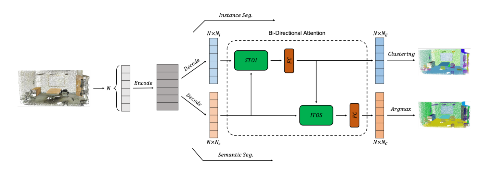

# Bi-Directional Attention for Joint Instance and Semantic Segmentation in Point Clouds(BAN)
[Guangnan Wu](https://github.com/pumpkinnan), [Zhiyi Pan](https://github.com/panzhiyi), [Peng Jiang](https://github.com/sdujump), Changhe Tu

The full paper is available at: [https://arxiv.org/abs/2003.05420](https://arxiv.org/abs/2003.05420)

## Introduction

In this work, we build a Bi-Directional Attention module on backbone neural networks for 3D point cloud perception, which uses similarity matrix measured from features for one task to help aggregate non-local information for the other task, avoiding the potential feature exclusion and task conflict. 



## Performance on 3D pointcloud datasets

Table 1. Ins. and Sem. segmentation results on **S3DIS** dataset.

|   Method   |   mCov   |  mWCov   |  mPrec   |   mRec   |   mAcc   |   mIoU   |   oAcc   |
| :--------: | :------: | :------: | :------: | :------: | :------: | :------: | :------: |
| PointNet++ |   49.6   |   53.4   |   62.7   |   45.8   |   69.0   |   58.2   |   85.9   |
|    ASIS    |   51.2   |   55.1   | **63.6** |   47.5   |   70.1   |   59.3   |   86.2   |
|JSNet(pointnet++)|   46.4   |   50.3   | 58.9 |   43.0   |   65.5   |   56.3   |   85.5   |
|    Ours    | **52.1** | **56.2** |   63.4   | **51.0** | **71.7** | **60.8** | **87.0** |

Table 2. Ins. and Sem. segmentation results on **PartNet** dataset.

|   Method   |   mCov   |  mWCov   |  mPrec   |   mRec   |   mAcc   |   mIoU   |   oAcc   |
| :--------: | :------: | :------: | :------: | :------: | :------: | :------: | :------: |
| PointNet++ |   42.0   |   43.1   |   51.2   |   44.7   |   53.4   |   43.4   |   78.4   |
|    ASIS    |   39.3   |   40.2   |   49.9   |   42.8   |   50.6   |   40.2   |   76.7   |
|    Ours    | **42.7** | **44.2** | **52.8** | **45.3** | **56.1** | **44.9** | **80.3** |

Table 3. Ins. and Sem. segmentation results on **SceneNN** dataset.

|   Method   |   mCov   |  mWCov   |  mPrec   |  mRec  |   mAcc   |   mIoU   |   oAcc   |
| :--------: | :------: | :------: | :------: | :----: | :------: | :------: | :------: |
| PointNet++ |   13.1   |   14.1   |   39.8   |  22.5  |   31.5   |   24.5   |   69.3   |
|    ASIS    |    15    |   16.1   |   36.2   |  23.6  |   31.1   |   24.8   |   69.5   |
|    Ours    | **15.8** | **16.7** | **43.1** | **24** | **35.5** | **26.6** | **70.8** |

Figure 1.  Instance and semantic segmentation in point clouds using BAN. (a) Results on the S3DIS dataset, (b) Results on the PartNet dataset.


Please refer to our paper for more results.

## Dependencies

The code has been tested with Python 3.7 on Ubuntu 16.04.
* tensorflow 1.14
* h5py
* IPython
* scipy
## Data and Model
Download 3D indoor parsing dataset (S3DIS Dataset). Version 1.2 of the dataset is used in this work.
```
python collect_indoor3d_data.py
python gen_h5.py
cd data && python generate_input_list.py
cd ..
```
## Usage
* Compile TF Operators  
Refer to [PointNet++](https://github.com/charlesq34/pointnet2)
* Training
```
python train.py
```
* Estimate_mean_ins_size
```
python estimate_mean_ins_size.py
```
* Test
```
python test.py --verbose
```
* Evaluation
```
python eval_iou_accuracy.py
```

## Common Issues

Coming soon.

## Acknowledgemets
This code largely benefits from following repositories: [PointNet++](https://github.com/charlesq34/pointnet2), [SGPN](https://github.com/laughtervv/SGPN), [DGCNN](https://github.com/WangYueFt/dgcnn), [DiscLoss-tf](https://github.com/hq-jiang/instance-segmentation-with-discriminative-loss-tensorflow) and [ASIS](https://github.com/WXinlong/ASIS)
